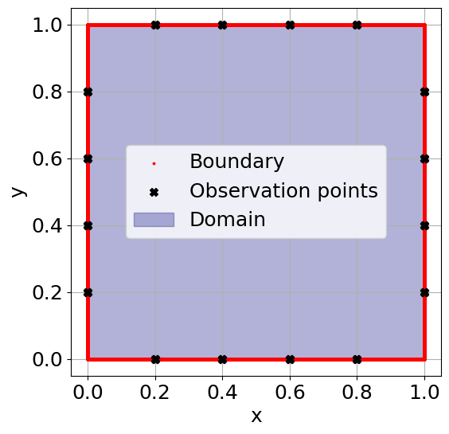
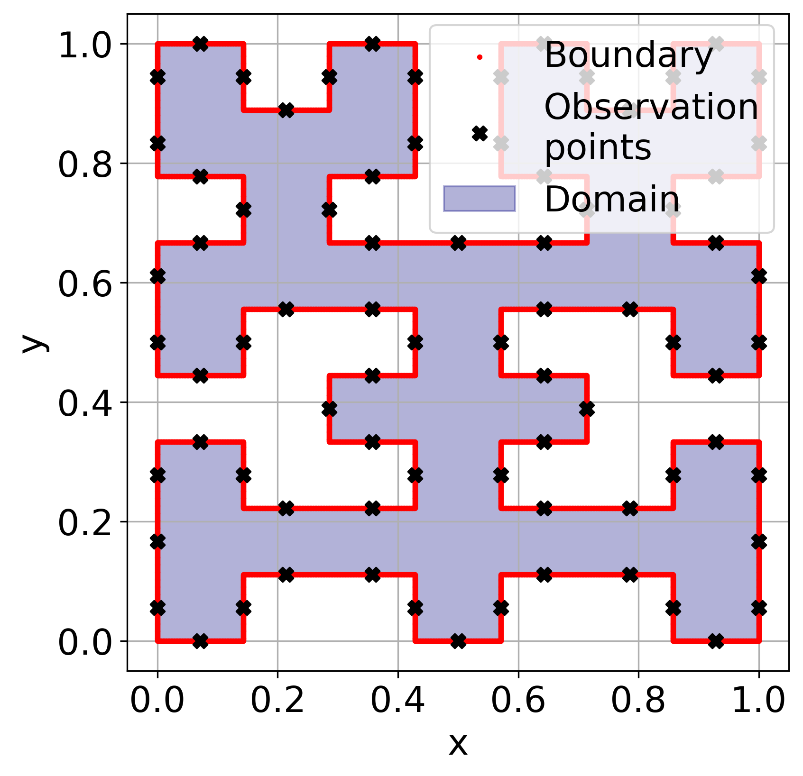
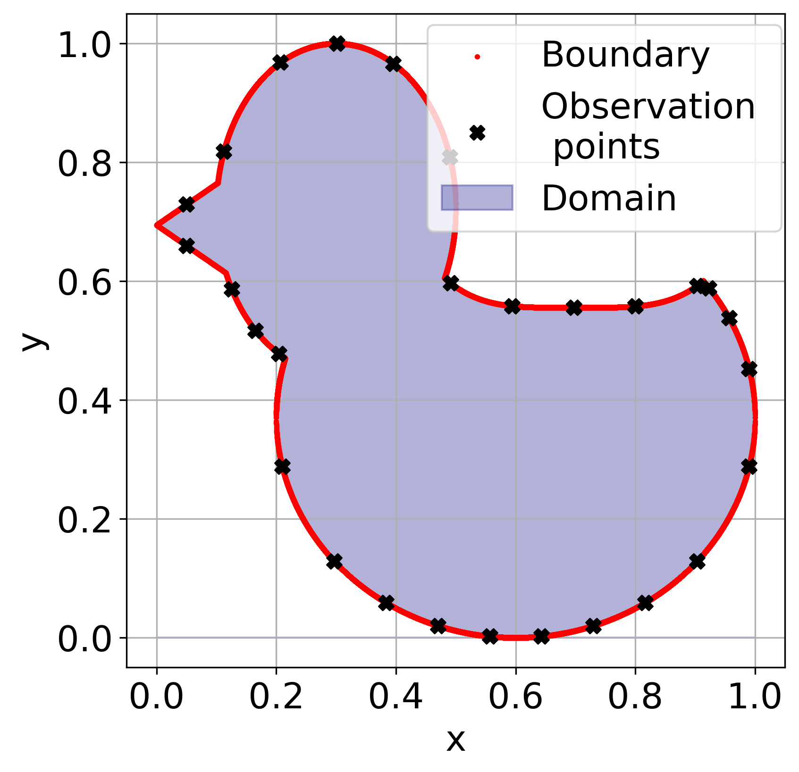
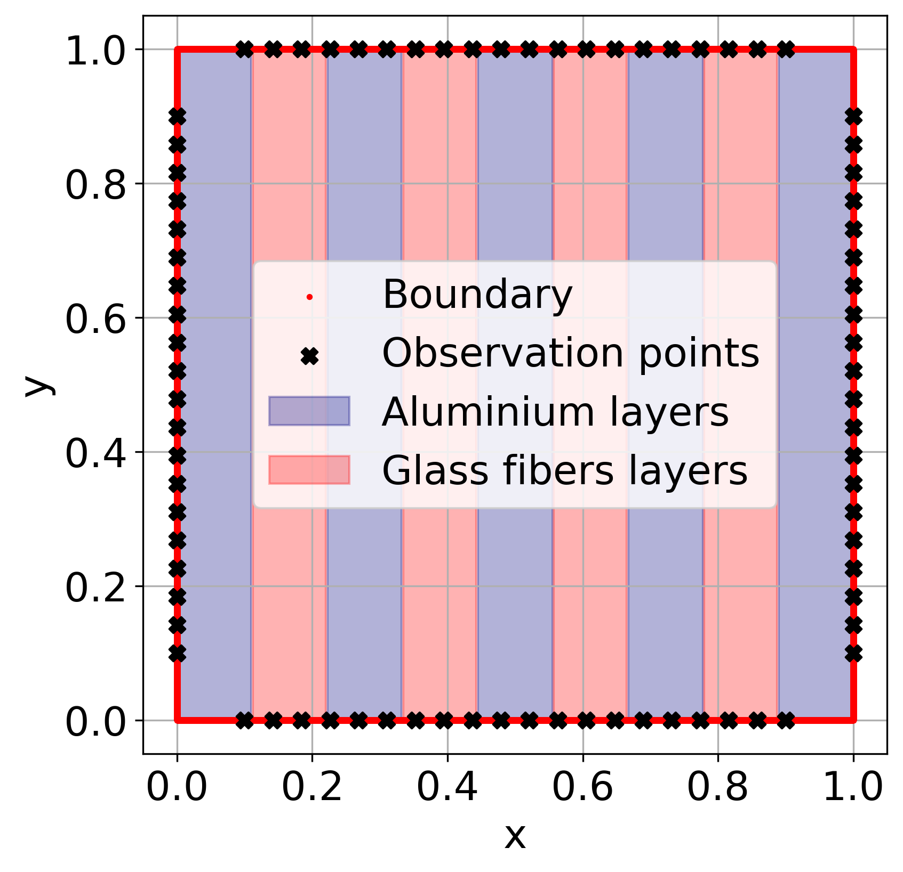
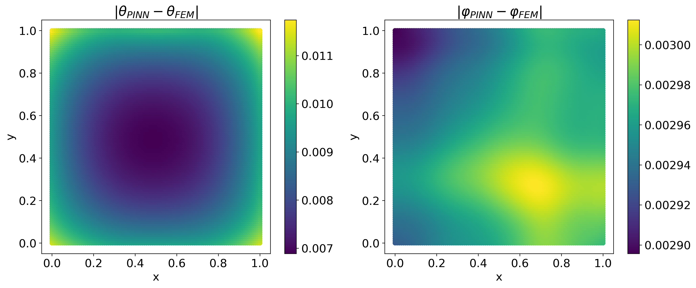
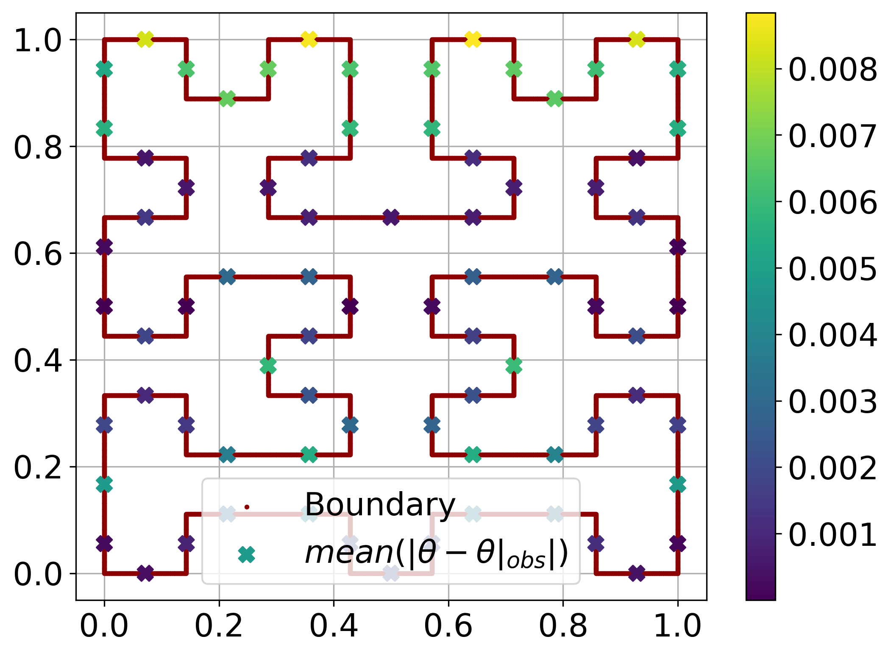
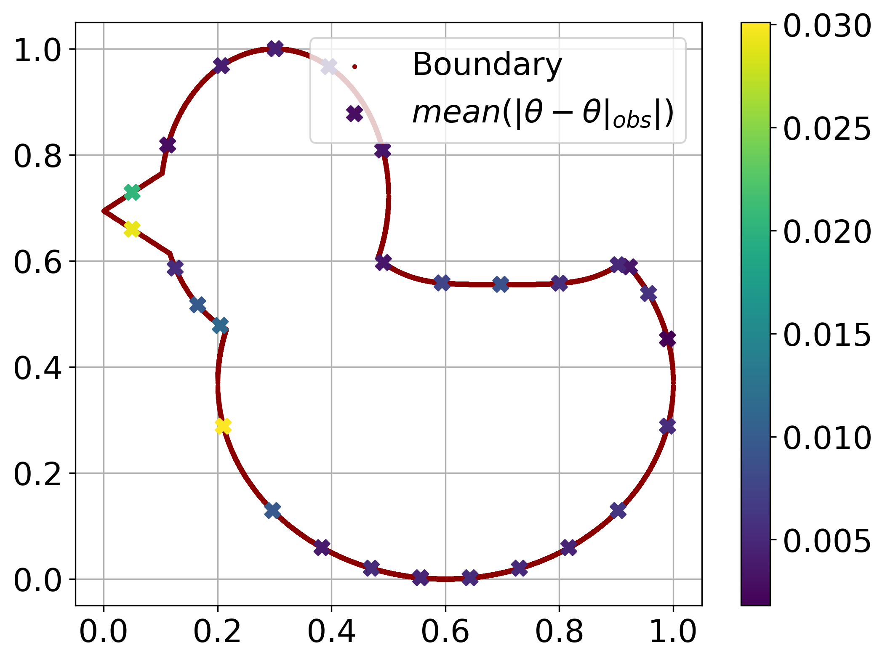
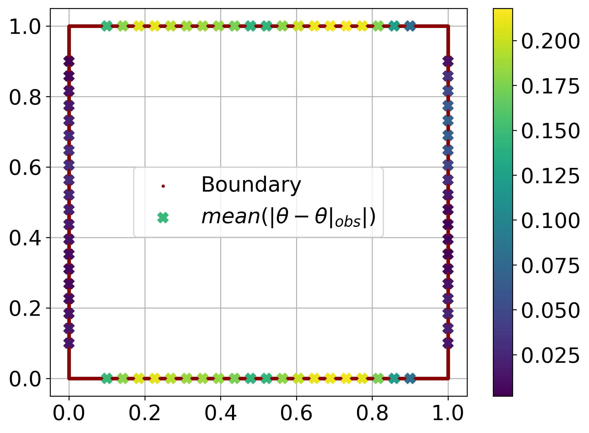

# PINN for Inverse Boundary-Value Problems of Complex Heat Transfer

<p align="center">
  <strong>Physics-informed reconstruction of temperature, radiation intensity, and unknown boundary coefficients in complex geometries</strong>
</p>

<p align="center">
  
  
  
  
</p>

This repository contains the numerical implementation accompanying the study **“Physics Informed Neural Network for Solving Inverse Boundary-Value Problems of Complex Heat Transfer”** by **Kirill Kuznetsov** and **Elena Amosova** (Far Eastern Federal University).

The inverse problem is to recover the temperature field $\theta$, radiation intensity $\varphi$, heat-transfer coefficient $h$, and surface reflection coefficient $\gamma$ from sparse boundary-temperature measurements. The proposed PINN combines the governing equations with observation data, Fourier feature encoding, pointwise adaptive loss weights, and physically constrained output parameterizations.

## Problem formulation

The coupled conductive–radiative model is

```math
\frac{\partial \theta}{\partial t}
- \mathrm{Fo}\,\Delta\theta
+ \mathrm{Fo}\,\Xi_{\mathrm{rad}}
\left(|\theta|\theta^3-\varphi\right)=0,
```

$$
-S\Delta\varphi+\alpha\left(\varphi-|\theta|\theta^3\right)=0,
\qquad (\mathbf{x},t)\in\Omega\times[0,1],
$$

with the initial and Robin boundary conditions

$$
\theta(\mathbf{x},0)=\theta_0(\mathbf{x}),
$$

$$
\frac{\partial\theta}{\partial n}
+\mathrm{Bi}(h)(\theta-\theta_b)=0,
\qquad
S\frac{\partial\varphi}{\partial n}
+\gamma(\varphi-\theta_b^4)=0.
$$

Here $h=h(x,y)$ and $\gamma=\gamma(x,y)$ are unknown, time-independent functions on the boundary. Sparse measurements of $\theta$ constrain the inverse solution.

## PINN formulation

Four neural networks approximate $\hat\theta$, $\hat\varphi$, $\hat h$, and $\hat\gamma$. Training minimizes the composite objective

$$
L=\lambda_r L_r+\lambda_{BC}L_{BC}+\lambda_{IC}L_{IC}+\overline{J},
$$

where $L_r$ contains the PDE residuals, $L_{BC}$ and $L_{IC}$ enforce boundary and initial conditions, and $\overline{J}$ measures disagreement with the observed temperatures.

Key implementation choices:

- **Fourier feature encoding** enriches the spatial–temporal input representation.
- **Pointwise self-adaptive weights** emphasize difficult residual, boundary, and initial-condition points during training.
- **Sobol sequences** generate collocation points throughout the domain and on its boundary.
- **Physical output constraints** keep the reconstructed quantities admissible: a logistic map bounds $\gamma$, while an exponential parameterization keeps $h$ positive.
- **Independent networks** represent the two state fields and two unknown boundary coefficients.

The numerical setup used in the study employs three hidden layers with 30 neurons per layer and `tanh` activations. Typical runs use 60,000 interior, 30,000 boundary, and 8,000 initial-condition points. Optimization uses Adam for up to 30,000 iterations, with an upper learning-rate bound of $2\times10^{-4}$.

## Numerical experiments

The repository covers four representative configurations, ranging from a verification problem on a square to nonsmooth and heterogeneous domains.

| Experiment | Configuration | Notebook |
|---|---|---|
| **NE1** | Square domain; forward-problem verification against FreeFEM++ | [`NE1/PINN.ipynb`](NE1/PINN.ipynb) |
| **NE2** | Inverse problem in a fractal-like domain | [`NE2/PINN.ipynb`](NE2/PINN.ipynb) |
| **NE3** | Inverse problem in a domain with a complex curved shape and small interior angles | [`NE3/PINN.ipynb`](NE3/PINN.ipynb) |
| **NE4** | Inverse problem for a layered aluminium/glass-fibre material | [`NE4/PINN.ipynb`](NE4/PINN.ipynb) |

<table>
  <tr>
    <td align="center"><br><b>NE1 — square</b></td>
    <td align="center"><br><b>NE2 — fractal-like domain</b></td>
    <td align="center"><br><b>NE3 — complex shape</b></td>
    <td align="center"><br><b>NE4 — layered material</b></td>
  </tr>
</table>

### Verification against a finite-element solution

The direct problem in NE1 is solved independently with the PINN and with FreeFEM++. In the reported test, the relative $L_2$ error is approximately **0.5% for temperature** and **2% for radiation intensity**.

<p align="center">
  
</p>

### Observation-point reconstruction

The plots below show the time-averaged absolute temperature mismatch at boundary observation points for the three inverse configurations.

<table>
  <tr>
    <td align="center"><br><b>NE2</b></td>
    <td align="center"><br><b>NE3</b></td>
    <td align="center"><br><b>NE4</b></td>
  </tr>
</table>

### Training dynamics and field evolution

Each experiment includes a loss history and an animation of the reconstructed fields. Open the sections below to preview the full-resolution GIFs.

<details>
  <summary><b>NE1 — square-domain verification</b></summary>
  <p align="center"></p>
</details>

<details>
  <summary><b>NE2 — fractal-like domain</b></summary>
  <p align="center"></p>
</details>

<details>
  <summary><b>NE3 — complex curved domain</b></summary>
  <p align="center"></p>
</details>

<details>
  <summary><b>NE4 — layered material</b></summary>
  <p align="center"></p>
</details>

## Main findings

- The PINN reproduces the finite-element solution of the forward coupled problem with low relative error in the verification case.
- The method reconstructs admissible boundary-coefficient fields in square, fractal-like, sharply curved, and layered domains.
- The observation mismatch in the main inverse experiments decreases to approximately $10^{-4}$ to $10^{-3}$ over 30,000 epochs.
- Physics-informed reconstruction suppresses part of the imposed observation noise instead of simply fitting it.
- Recovering $h$ and $\gamma$ simultaneously remains ill-conditioned: coefficient errors can grow much faster than the temperature error, particularly when the measured field has weak sensitivity to radiative transfer.

The analytical part of the study establishes existence of a minimizer for the regularized inverse functional. The logarithmic stability estimate is stated as a hypothesis supported by numerical evidence; its complete proof for the coupled nonlinear parabolic–elliptic system remains open.

## Repository structure

```text
.
├── NE1/
│   ├── PINN.ipynb              # square-domain PINN experiment
│   ├── FreeFem/                # independent FEM verification
│   ├── images/
│   └── gif/
├── NE2/
│   ├── PINN.ipynb              # fractal-like domain
│   ├── images/
│   └── gif/
├── NE3/
│   ├── PINN.ipynb              # complex curved domain
│   ├── images/
│   └── gif/
└── NE4/
    ├── PINN.ipynb              # layered material
    ├── images/
    └── gif/
```

## Running the notebooks

Clone the repository and open the experiment you want to reproduce:

```bash
git clone https://github.com/kuznetsovks17/PINN-for-inverse-boundary-complex-heat-transfer-problem.git
cd PINN-for-inverse-boundary-complex-heat-transfer-problem
jupyter lab
```

The notebooks use Python with TensorFlow/Keras, NumPy, SciPy, Matplotlib, Pillow, scikit-optimize, and `tf-fourier-features`. NE1 additionally contains a FreeFEM++ reference implementation. GPU acceleration is recommended for the full training runs; the reported experiments were run on an NVIDIA GeForce RTX 3070 Ti.

> **Reproducibility note:** the notebooks are research code and include experiment-specific paths and parameters. Review the configuration cells before starting a run. Training a main experiment takes approximately 35–60 minutes on the reference hardware; the FreeFEM++ verification run reported in the study took about 95 minutes.

## Citation

If this code is useful in your research, please cite the accompanying work:

```bibtex
@article{kuznetsov_amosova_pinn_heat_transfer,
  title   = {Physics Informed Neural Network for Solving Inverse Boundary-Value Problems of Complex Heat Transfer},
  author  = {Kuznetsov, Kirill and Amosova, Elena},
  note    = {Manuscript}
}
```

## Authors

**Kirill Kuznetsov** and **Elena Amosova**<br>
Far Eastern Federal University, Vladivostok, Russia
